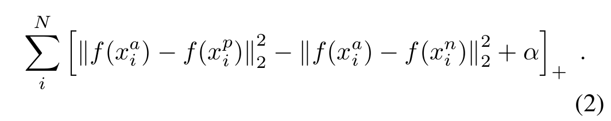

# Face Verification API
Face recognition problems commonly fall into two categories:

 * Face Verification :- "is this the claimed person?". For example, you can pass through by letting a system scan your passport and then verifying that you (the person carrying the passport) are the correct person. A mobile phone that unlocks using your face is also using face verification. This is a 1:1 matching problem.
 
 * Face Recognition :- "who is this person?". For example, employees entering the office without needing to otherwise identify themselves. This is a 1:K matching problem.
  
  The aim of this framework is to detect and recognize face from images in database. It Employs a Siamese Network with Triplet Loss function([FaceNet Model](https://arxiv.org/abs/1503.03832)) to perform the task of face recognition. Frontal Face Detection and cropping of image is done with help of [OpenCV Haar Feature-based Cascade Classifiers](https://docs.opencv.org/3.3.0/d7/d8b/tutorial_py_face_detection.html). 
   
   FaceNet learns a neural network that encodes a face image into a vector of 128 numbers. By comparing two such vectors, you can then determine if two pictures are of the same person.
   
   This Entire Model is henceforth built and is rolled into an Django API for cross-platform accessiblity. 

# Setup
#### For setting up this API in a local machine:-

1. Install requirements (Run following command in CMD)

```
   pip install -r requirements.txt
```

2. Navigate to the base folder in CMD (Namely the folder containing manage.py of this webapp)


3. Setup the API Migrations(run both commands)

```
   python manage.py makemigrations
   python manage.py migrate
```
4. Run the app

```
   python manage.py runserver
```

Note: This entire framework was built and tested with Cuda 10.1(Nvidia) and cuDNN compatible with 10.1 for GPU support,
Using other version of these software in hosting environment may cause problems.

# API Structure Overview
```
   BASE URL
   |
   |-- /admin
   |
   |-- /api
       |
       |-- /person
       |   |
       |   |-- /listall
       |   |-- /create
       |   |-- /update/<str:id>
       |   |-- /delete/<str:id>
       |
       |-- /face
       |   |
       |   |-- /listall
       |   |-- /create
       |   |-- /listbyperson/<str:id>
       |   |-- /update/<str:id>
       |   |-- /delete/<str:id>
       |
       |-- /verify
       |   |
       |   |-- /linear
       |   
       |-- /dev
       |   |
       |   |-- /embeddings/<str:id>
       |
       |-- /help/<str:url>
```

If hosted on local machine base URL would be similar to http: //localhost:xxxx.

For additional information on any of these urls pass those urls to /help with a get request in form of '/help/api/.......'. This will return a JSON Response containing the information on that URLs working.

# Overview of ML Model
 
 This Model uses an Inception Model to create embeddings from a 96x96 dimensional RGB image as its input.And henceforth, outputs a matrix that encodes each input face image into a 128-dimensional vector.<br>
 
 Then these encodings are used to compare two images as follows:
 
 The cost function layer(distance in above image) uses Triplet Loss. A general equation of triplet loss is as follows
  
 During Training triplets of images (A,P,N) are used namely:
    A is an "Anchor" image--a picture of a person.
    P is a "Positive" image--a picture of the same person as the Anchor image.
    N is a "Negative" image--a picture of a different person than the Anchor image.
 
 The triplet loss function tries to "push" the encodings of two images of the same person (Anchor and Positive) closer together, while "pulling" the encodings of two images of different persons (Anchor, Negative) further apart. Specifically minimize the l2 norm betwwen encoding vectors of (Anchor,Positive) and maximize the l2 norm between encoding vectors of (Anchor,Negative)
 
 The Model is trained by minimizing the triplet loss.Following are some examples of distances between the encodings between three individuals: 
 
  


# Tasks
#### General Model Stucture
+ [ ] Face Detection(Not yet Implemented)
    - [ ] Haar Cascade Classifier
+ [ ] Face Alignment
+ [x] Face Verification
    - [x] Base CNN model building and training
    - [x] Face verification metric measure
+ [ ] Interactive Demo
+ [x] API

#### API Features
+ [x] Linear Verify
+ [ ] K-NN Verify

## Useful Links:
* [FaceNet: A Unified Embedding for Face Recognition and Clustering](https://arxiv.org/abs/1503.03832)
* [OpenCV: HaarCascades for Frontal Face Detection](https://docs.opencv.org/3.3.0/d7/d8b/tutorial_py_face_detection.html)
* [One-Shot Learning: Face Recognition using Siamese Neural Network](https://towardsdatascience.com/one-shot-learning-face-recognition-using-siamese-neural-network-a13dcf739e)
* [Siamese Network: Explained by Andrew NG](https://www.coursera.org/lecture/convolutional-neural-networks/siamese-network-bjhmj)
